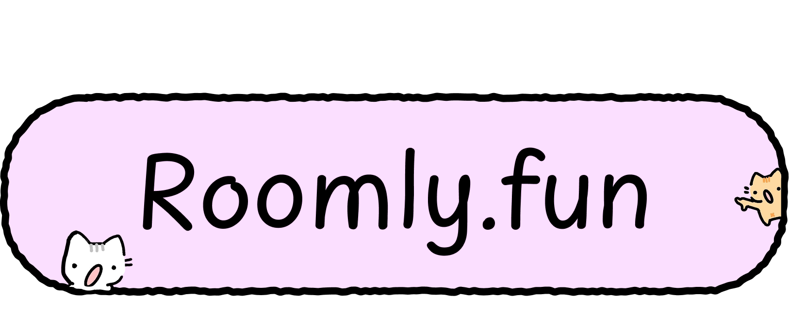

# Hi, I'm S1MS4

Studying **AI Systems Engineering**

- **AI & Automation** – Systems, tooling, and scripting
- **Game Dev** – Unity and Roblox development
- **Web Dev** – Full-stack experiments and interactive UI
- **3D Graphics** – Modeling, texturing, and rendering

**Languages:**

 

**Frameworks & Tools:**

