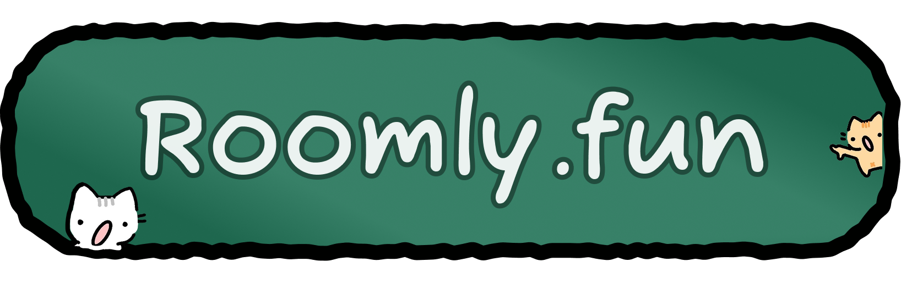

# S1MS4

**Developer & Automations Engineer**
studying **AI Systems Engineering**

**Python** is my primary language; I also work in **JavaScript**, **C**, and **C++**.

**Languages:**

**Frameworks & Tools:**

<i>we bow to Dario Amodei</i>
